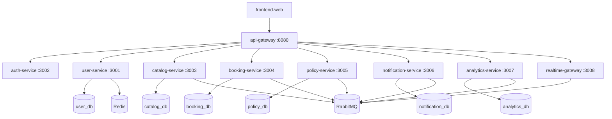

# .github

Organization profile and defaults for [Library Booking System](https://github.com/LibraryBookingSystem).

The org overview on GitHub is rendered from [`profile/README.md`](./profile/README.md). Full project documentation lives in the [Documentation](https://github.com/LibraryBookingSystem/Documentation) repository.

## Architecture

Each persistence-backed microservice maps to one PostgreSQL database. `auth-service`, `api-gateway`, and `realtime-gateway` are stateless at the database layer.
