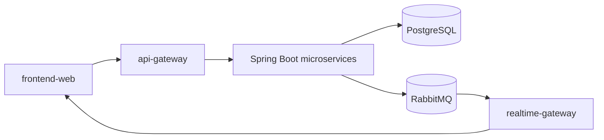

# Library Booking System

Microservice platform for reserving library seats and rooms. A Flutter client talks to Spring Boot services through one API gateway, with JWT and role-based access, policy checks before bookings, RabbitMQ-driven updates, and Docker Compose for a full local stack.

## What it does

- Authenticate users and issue JWTs with shared RBAC across services
- Manage users, resources, bookings, policies, notifications, and analytics
- Stream live availability and domain events over WebSockets
- Run the backend locally with PostgreSQL, Redis, RabbitMQ, and PowerShell setup scripts

## Architecture

## Start here

| Repository | Purpose |
| --- | --- |
| [Documentation](https://github.com/LibraryBookingSystem/Documentation) | Architecture, API reference, authorization |
| [docker-compose](https://github.com/LibraryBookingSystem/docker-compose) | Run the full backend locally |
| [frontend-web](https://github.com/LibraryBookingSystem/frontend-web) | Flutter client |

## Services

`auth-service` · `user-service` · `catalog-service` · `booking-service` · `policy-service` · `notification-service` · `analytics-service` · `api-gateway` · `realtime-gateway` · `common-aspects`

## Stack

Java 17 and Spring Boot 3.5, PostgreSQL, RabbitMQ, Redis, Nginx, Node.js WebSockets, Flutter / Dart 3+.
